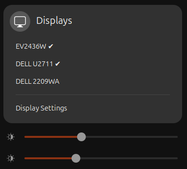

# Displays GNOME shell extension

Offers switches to turn extra displays on and off, offers sliders to control their brightness.



When using multiple displays one often wishes to turn selected displays on and off. GNOME settings panel allows that, but every time display is turned off it is loosing it's position in the layout of the displays. This extension remembers the last configuration that includes all the displays and uses it to preserve the layout, while offering simple on/off switches for each display.

To control brightness of external displays (through DDC) install `ddcutil-service`. Installation process of `ddcutil-service` is quick and non-intrusive. `ddcutil-service` allows more responsive communication with the displays than standalone calls to `ddcutil`.

A convenient way to install GNOME extensions, including this extension is to use [Extension Manager](https://flathub.org/apps/com.mattjakeman.ExtensionManager).

## Dependencies

* GNOME 46
* Python >= 3.6 (many distributions install it by the default)
* `ddcutil-service` (optional, for brightness control)  
  * [Ubuntu and Debian packages](https://gitlab.com/w8jcik/ddcutil-service.deb) (built by me)
  * [Arch AUR package](https://aur.archlinux.org/packages/ddcutil-service)
  * [OpenSUSE packages](https://software.opensuse.org/package/ddcutil-service)
  * Manual installation
    - Dependencies `ddcutil` and `libddcutil`  
      For example in Ubuntu and Debian
      ```bash
      sudo apt install ddcutil libddcutil-dev
      ```
      `ddcutil` is not used directly, it only provides Udev rules.
    - Build and install the service
      ```bash
      git clone git@github.com:digitaltrails/ddcutil-service.git
      cd ddcutil-service
      make
      make install
      ```
      Service installs to `~/.local/share/dbus-1/services/com.ddcutil.DdcutilService.service` and `~/.local/bin/ddcutil-service`. It is activated after the next login.

# Development

## Clone

```bash
cd ~/.local/share/gnome-shell/extensions
git clone https://gitlab.com/w8jcik/toggle-displays.git displays@w8jcik.gitlab.com
cd displays@w8jcik.gitlab.com
glib-compile-schemas schemas/
```

`git clone git@gitlab.com:w8jcik/toggle-displays.git` for development.

## Start

```bash
export MUTTER_DEBUG_DUMMY_MODE_SPECS="1366x768"
```

```bash
dbus-run-session -- gnome-shell --nested
```

## Dbus examples

This extension largely depends on a Mutter interface called `DisplayConfig`

Consider example of three displays
  * `DP-1` `1920x1200@59.950`
  * `DP-2` `2560x1440@59.951`
  * `HDMI-2` `1680x1050@59.954`

Example call to distribute displays left to right

```bash
serial=$(gdbus call --session --dest=org.gnome.Mutter.DisplayConfig --object-path /org/gnome/Mutter/DisplayConfig --method org.gnome.Mutter.DisplayConfig.GetResources | awk ' { print $2 }' | grep -oE [0-9]+)

gdbus call --session \
    --dest=org.gnome.Mutter.DisplayConfig \
    --object-path /org/gnome/Mutter/DisplayConfig \
    --method org.gnome.Mutter.DisplayConfig.ApplyMonitorsConfig \
    ${serial} 1 "[(0, 240, 1.0, 0, false, [('DP-1', '1920x1200@59.950', [])]), (1920, 0, 1.0, 0, true, [('DP-2', '2560x1440@59.951', [])]), (4480, 390, 1.0, 0, false, [('HDMI-2', '1680x1050@59.954', [])])]" "[]"
```

Example retrieval of display configuration from Mutter using GJS

```js
// gdbus call --session --dest=org.gnome.Mutter.DisplayConfig --object-path /org/gnome/Mutter/DisplayConfig --method org.gnome.Mutter.DisplayConfig.GetResources

const displayResources = await proxy.GetResourcesAsync()
console.log("[toggle-displays] Display resources", displayResources)
const [rawSerial, crtcs, outputs, modes] = displayResources

// gdbus call --session --dest=org.gnome.Mutter.DisplayConfig --object-path /org/gnome/Mutter/DisplayConfig --method org.gnome.Mutter.DisplayConfig.GetCurrentState

const currentState = await proxy.GetCurrentStateAsync()
console.log("[toggle-displays] Current displays state", currentState)
const [rawSerial, monitors, logicalMonitors, properties] = currentState
```

## Display configuration from GNOME settings

Example reading of display configurations from `~/.config/monitors.xml`

```bash
python parse-monitors-config.py --indent
```
