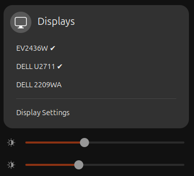

# Multi Display Adjustment GNOME shell extension

> [!TIP]
> Originally based on [display-adjustment](https://gitlab.com/w8jcik/display-adjustment) by Maciej Wójcik.
> Details: [CHANGELOG.md](./CHANGELOG.md).

Offers sliders in Quick Settings to control the brightness and contrast of external displays
through DDC/CI, one set per display, under the display name that Settings shows. Moving a slider
shows the level in the on-screen display of the screens it adjusts, as GNOME does for a laptop's
own screen.



## Installation

### 0. Dependencies

* GNOME 46-50
* [_ddcutil-service_](https://github.com/digitaltrails/ddcutil-service), allows more responsive communication with the displays than calling `ddcutil`.

### 1. Installation of _ddcutil-service_

* **Arch Linux** — [from the AUR](https://aur.archlinux.org/packages/ddcutil-service), for example `yay -S ddcutil-service`
* **openSUSE** — `sudo zypper install ddcutil-service`
* **Debian 12 and 13, Ubuntu 24.04 to 26.04** — unofficial `amd64` packages by Maciej Wójcik

  ```bash
  . /etc/os-release
  wget -O /tmp/ddcutil-service.deb "https://gitlab.com/api/v4/projects/w8jcik%2fddcutil-service.deb/packages/generic/${ID^}-${VERSION_ID}/1.0.14/ddcutil-service_1.0.14+${VERSION_CODENAME}-amd64.deb"
  sudo apt install /tmp/ddcutil-service.deb
  ```

* **Fedora and any other** — [build it from source](./installation.md#build-ddcutil-service-from-source)

Usually nothing else has to be set up for the displays to be reachable. If the sliders do not show
up, see [Access to the displays](./installation.md#access-to-the-displays).

### 2. Installation of the extension

Install it from
[extensions.gnome.org](https://extensions.gnome.org/extension/10707/multi-display-adjustment/), in
the browser or with an app such as Extension Manager.

A new version shows up there once it passes review. To get the newest one before that, see
[Install from a release](./installation.md#install-from-a-release).

# See more

## Using

* [Configuring](./configuring.md)

## Troubleshooting

* [Diagnosing issues](./troubleshooting.md#diagnosing-issues)
* [Known issues](./troubleshooting.md#known-issues)

# Thanks

* [@hopsayer](https://github.com/hopsayer), for the inline sliders and much of what came with them
  in 1.4.0.
* Everyone who reports an issue or tries a change on their own displays. See the
  [contributors](https://github.com/samuelcecilio/multi-display-adjustment/graphs/contributors) for
  everyone whose code is in here.

# License

This extension is distributed under the terms of the GNU General Public License, version 2 or later.

Copyright of the original work belongs to Maciej Wójcik and the contributors to
[w8jcik/display-adjustment](https://gitlab.com/w8jcik/display-adjustment). Modifications in this fork are
copyright their respective authors and released under the same license. See [COPYING](./COPYING).
